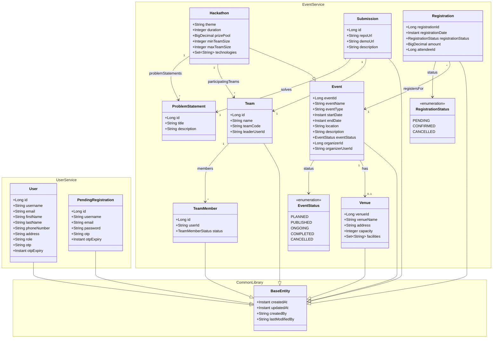

# HackHub Class Diagram

## Backend Domain Model

## Description
- **UserService**: Manages user identities (`User`) and temporary registration data (`PendingRegistration`).
- **EventService**: The core domain.
    - `Event` is the base class for events. `Hackathon` extends it with specific fields like `theme`, `prizePool`, etc.
    - `Venue` stores location details.
    - `Registration` tracks who is attending which event.
    - `Team` and `TeamMember` manage hackathon participation.
    - `ProblemStatement` defines the challenges in a hackathon.
    - `Submission` links a `Team`'s work to a `ProblemStatement`.
- **Inheritance**: specific entities inherit audit fields from `BaseEntity`.

## Notes
- `id` fields often use Snowflake IDs for distributed uniqueness.
- Cross-service references (e.g., `organizerUserId` in `Event` referring to `User`) are stored as Strings/IDs to maintain loose coupling between microservices.
