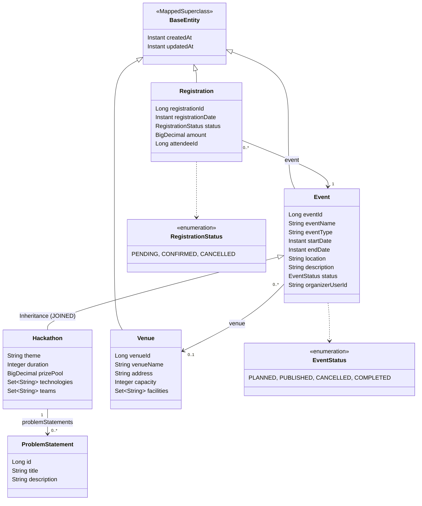

# Event Service Class Diagram

This diagram represents the entity relationships within the Event Service.

```mermaid
classDiagram
    %% Core Entities
    class BaseEntity {
        <<MappedSuperclass>>
        Instant createdAt
        Instant updatedAt
    }

    class Event {
        Long eventId
        String eventName
        String eventType
        Instant startDate
        Instant endDate
        String location
        String description
        EventStatus status
        String organizerUserId
    }

    class Hackathon {
        String theme
        Integer duration
        BigDecimal prizePool
        Set~String~ technologies
        Set~String~ teams
    }

    class Venue {
        Long venueId
        String venueName
        String address
        Integer capacity
        Set~String~ facilities
    }

    class Registration {
        Long registrationId
        Instant registrationDate
        RegistrationStatus status
        BigDecimal amount
        Long attendeeId
    }

    class ProblemStatement {
        Long id
        String title
        String description
    }

    %% Relationships
    BaseEntity <|-- Event
    BaseEntity <|-- Venue
    BaseEntity <|-- Registration
    
    Event <|-- Hackathon : Inheritance (JOINED)
    
    Event "0..*" --> "0..1" Venue : venue
    Registration "0..*" --> "1" Event : event
    Hackathon "1" --> "0..*" ProblemStatement : problemStatements

    %% Enums
    class EventStatus {
        <<enumeration>>
        PLANNED, PUBLISHED, CANCELLED, COMPLETED
    }
    
    class RegistrationStatus {
        <<enumeration>>
        PENDING, CONFIRMED, CANCELLED
    }
    
    Event ..> EventStatus
    Registration ..> RegistrationStatus
```
